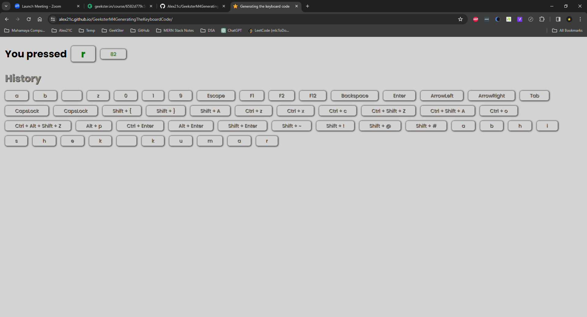

<!--
// Include a detailed README in the GitHub repository for the project.
// In the README, provide clear instructions on how to view the hosted version of the project.
// Include the hosted link to the live version of the project, ensuring it is accessible and functional.(10 Marks)
-->
# Generating the Keyboard Code

# Hosted Version of the Project:
[Geekster M4 Assignment&mdash;Generating The Keyboard Code](https://alex21c.github.io/GeeksterM4GeneratingTheKeyboardCode/)

# Author
[Abhishek kumar](https://www.linkedin.com/in/alex21c/), ([Geekster](https://geekster.in/) MERN Stack FS-14 Batch)
